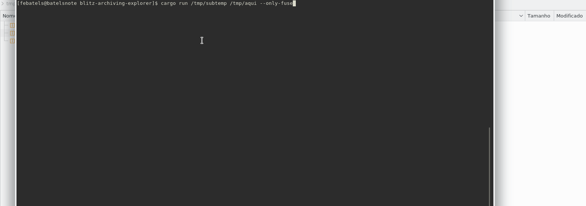

# Blitz Explorer

[](https://travis-ci.org/fernandobatels/blitz-explorer)


Service for search and get files inside a multiples .tar.gz files, but without extract entire tar.gz file and with cache(of indexed files and extracted files) for fast access.



## Starting the service

For now we use the cargo to run and use the application(soon there will be a daemon):

Start the server tcp and mounted interface:

```bash
mkdir /mnt/mytars
mkdir /var/db/blitze
cargo run /path/to/my/tar/files /mnt/mytars
```

The service provide two ways to use the files:

## 1. TCP Server

Search and download the indexed files inside of yours tar.gz files over a tpc connection.

The protocol basically have two only commands: /search and /download

```bash
cargo run /path/to/my/tar/files /mnt/mytars
```

Search the files (/search/FILE NAME HERE):

```bash
nc localhost 3355 <<< "/search/my photo.png"
```

The return will be printed in the stdout.

Download a file (/download/you compressed file.tar.gz:PATH/TO/FILE.png):

```bash
nc localhost 3355 <<< "/download/photos2018.tar.gz:path/to/my photo.png" > my photo.png
```

The return of /download command is the binary content of file and we redirect him to a local file.

For start only the TCP server:

```bash
cargo run /path/to/my/tar/files /mnt/mytars --only-tcp
```

## 2. FileSystem interface(With fuse)

For more interactivity you can use a mounted file system, on /mnt/mytars folder, to consume yours indexed files using a File Manager(like the Dolphin) for access yours files or just use the ls, cp...

For start only the fuse:

```bash
cargo run /path/to/my/tar/files /mnt/mytars --only-fuse
```

To unmount your "tars" file system:

```bash
fusermount -u /tmp/mytars
```
